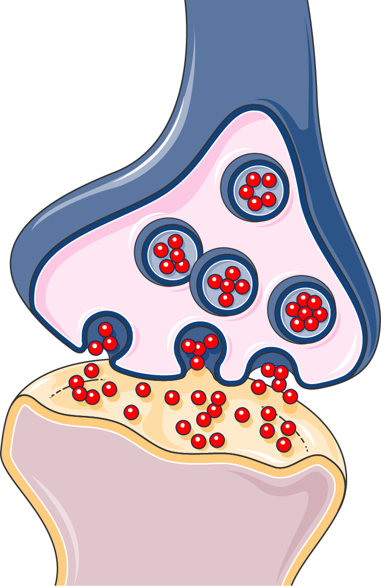

# Introducción

## Repaso: Modelo nomológico-deductivo

Explicar un fenómeno es **subsumirlo** bajo una ley.\pause

* Dar un argumento deductivo que vaya de \textcolor{red}{\textbf{leyes generales}} y \textcolor{green}{\textbf{condiciones antecedentes}} (*explanans*) al fenómeno a explicar (*explanandum*).\pause

\begin{figure}
\begin{tikzpicture}

\node[red] (laws) {$L_1, L_2, ..., L_n$};
\node[green] (conds) [below=0.1em of laws] {$C_1, C_2, ..., C_n$};

\draw (conds.south west) -- (conds.south east);
\node (expl) [below=0.5emof conds] {$E$};

\draw[decorate, decoration={brace, amplitude=5pt}, blue] (1.2, 6pt) -- (1.2, -24pt) node[midway, right, xshift=0.8em] {Explanans};

\draw[->, blue] (expl.east) -- ++(3em, 0) node [right] {Explanandum};

\end{tikzpicture}
\end{figure}

## Ciencias especiales

¿Se parecen todas las ciencias a la física? \pause

* La física parece apelar a una generalidad muy alta. \pause
* Hay muchas disciplinas más específicas que la física. \pause

Machamer-Darden-Craver (MDC): Revisemos otras disciplinas científicas \pause

* Biología \pause
* Neurociencias \pause

La filosofía de la ciencia también debe extenderse a otras formas de conocimiento.

## Leyes y ciencias especiales

No todas las disciplinas explican postulando leyes (presuntamente). \pause

* ¿Cuáles serían las leyes de la biología? \pause
* ¿De las ciencias sociales? \pause

Dos alternativas: \pause

:::: {.columns .onlytextwidth}
::: {.column}

Estas disciplinas no son genuinamente científicas.

* Eventualmente descubriremos sus leyes. \pause

:::
::: {.column}

\color{blue}

La filosofía de la ciencia ha asumido algo equivocado.

* No debemos reificar las leyes.

:::
::::

## Objetivos

1. Definir los conceptos de «mecanismos», «entidades», «actividades», «estructura» y «nivel».
2. Comprar y contrastar el modelo de explicación mecanicista y el modelo nomológico-deductivo de explicación.
3. Ejemplificar el modelo de explicación mecanicista con casos de la física, la biología y la neurociencia.

# El modelo mecanicista

## ¿Qué es un mecanismo?

:::: {.columns .onlytextwidth align=center}
::: {.column}

> Los mecanismos son **entidades** y **actividades organizadas** de tal manera que **producen cambios** regulares desde **condiciones iniciales** o de arranque [set-up] hasta de **finalización** o terminación. (p. 3)

\pause

:::
::: {.column}

\centering

{ height=20em }

:::
::::

## Ejemplo: Sinapsis

**Fenómeno:** Sinapsis neuronal (transmisión de señales a través de neuronas) \pause

:::: {.columns .onlytextwidth}
::: {.column width=30%}

**Entidades** \pause

Neuronas

* Presináptica
* Postsináptica \pause

Neurotransmisores \pause

Receptores \pause

:::
::: {.column width=67%}

**Actividades** \pause

1. Las neuronas **liberan** neurotransmisores. \pause
2. Los neurotransmisores se **difunden** en el espacio sináptico. \pause
3. Los neurotransmisores se **unen** a los receptores en la neurona postsináptica. \pause
4. Los receptores **despolarizan** la neurona postsináptica. \pause
5. La neurona postsináptica **transmite** una corriente.

:::
:::: 

## Entidades y actividades

**Actividades**: Producción de cambio \pause

**Entidades**: Cosas que producen cambio (i.e., que ejercen actividades) \pause

Según MDC, ambos conceptos son necesarios para entender los mecanismos. \pause

* Las actividades requieren entidades que las ejerzan.
  * Un poder causal requiere un objeto. \pause

* Las entidades sin actividades no explican nada.
  * Las entidades son explicativas por lo que pueden hacer.

## Condiciones iniciales y terminales

Un mecanismo se identifica por el **fenómeno** que produce. \pause

* Un mecanismo explica *cómo* se produce el fenómeno. \pause
* El fenómeno debe dar las **condiciones terminales** de la actividad del mecanismo. \pause

Un mecanismo siempre comienza en unas **condiciones iniciales**. \pause

* Pasa de condiciones iniciales a estados intermedios hasta las condiciones terminales. \pause
* Comprender el mecanismo es comprender todos estos estados.

## Organización

En un mecanismo, las entidades se **organizan** en una **estructura**. \pause

* Las relaciones e interacciones entre entidades son centrales. \pause

:::: {.columns .onlytextwidth}
::: {.column}

\centering 

**Secuencias**

Un mecanismo puede tener submecanismos en secuencia.

$M_1 \rightarrow M_2 \rightarrow M_3$ \pause

:::
::: {.column}

\centering 

**Niveles**

Un mecanismo puede tener mecanismos de más bajo nivel.

\begin{tikzpicture}

\node (M1) {$M_1$};
\node[draw, blue, dashed] (M2) [right of=M1] {$M_2$}; % Box around M2
\node (M3) [right of=M2] {$M_3$};

\node (M4) [below of=M1] {$M_4$};
\node (M5) [right of=M4] {$M_5$};
\node (M6) [right of=M5] {$M_6$};
\node[draw, fit=(M4) (M6), inner sep=5pt, blue, dashed] (B) {}; % Box around M4-6

\draw[blue, dashed] (M2.south west) -- (B.north west);
\draw[blue, dashed] (M2.south east) -- (B.north east);

\draw[->] (M1.east) -- (M2.west);
\draw[->] (M2.east) -- (M3.west);
\draw[->] (M4.east) -- (M5.west);
\draw[->] (M5.east) -- (M6.west);

\end{tikzpicture}

:::
::::

## Discusión: WC

¿Por qué se detiene el llenado del estanque del WC? \pause

Analice este fenómeno siguiendo el modelo mecanicista de explicación.

* Entidades
* Actividades
* Organización

Discutiremos este modelo en clase.

## Discusión: WC

\centering

.png){ height=20em }

# Condiciones de adecuación

## ¿Por qué pensar en mecanismos?

MDC piensan que los mecanismos juegan tres roles importantes en filosofía de la ciencia. \pause

1. Dan cuenta de cómo funciona el mundo \pause (**adecuación óntica**) \pause
2. Dan cuenta de cómo funcionan algunas ciencias \pause (**adecuacion descriptiva**) \pause
3. Dan cuenta de cómo **explican** las ciencias \pause (**adecuación epistémica**)

## Adecuación óntica

**Compromiso metafísico:** en el mundo hay mecanismos. \pause

* Hay entidades que ejercen actividades para producir cambios. \pause

¿Qué compromisos adicionales acarrea esta metafísica? \pause

:::: {.columns .onlytextwidth}
::: {.column}

**Actividades y causas**

Las actividades son tipos de *causas*. \pause

* ¿Qué es una **causa**? \pause
  * Rechazo a una teoría humeana (basada en regularidad) \pause
  * Teoría óntica de la causalidad (Salmon) \pause

:::
::: {.column}

**Actividades y leyes**

Las leyes no describen actividades. \pause

* Podemos explicar sin apelar a leyes. \pause
* Rechazo al modelo nomológico-deductivo.

:::
::::

## Adecuación descriptiva

El modelo mecanicista se ajusta a lo que ocurre en distintas ciencias. \pause

* Biología
* Neurociencias \pause

Explica varias actividades científicas y su rol epistémico: \pause

* Construcción de diagramas y esquemas \pause
* Simulaciones \pause

No todo lo que ocurre en ciencia es **generalización**.

## Adecuación epistémica

Explicar un fenómeno es (en algunas ciencias) **encontrar el mecanismo** que lo produce. \pause

Conocer el mundo pasa por encontrar cómo las entidades interactúan. \pause

* No es necesario subsumir fenómenos bajo una ley. \pause
* Separación entre **inteligibilidad** y **regularidad**. \pause

**Salmon**: Las explicaciones están en el mundo; los humanos las encuentran.

## Resumen

Según del modelo de explicación mecanicista, explicar un fenómeno es encontrar el mecanismo que lo produce. \pause

* Encontrar **entidades** y **actividades organizadas** que producen el fenómeno. \pause

Según MDC, hay tres ventajas mayores del modelo mecanicista: \pause

* Es ónticamente adecuado (nos dice qué hay en el mundo) \pause
* Es empíricamente/históricamente adecuado (nos dice cómo funcionan las ciencias) \pause
* Es epistémicamente adecuado (nos dice cómo conocemos/comprendemos el mundo)

# Preguntas

## Niveles y perspectivas

:::: {.columns .onlytextwidth align=center}
::: {.column}

Un mecanismo puede:

* Participar de mecanismos de más alto nivel.
* Incluir mecanismos de más bajo nivel. \pause

¿Existen **entidades fundamentales** (no descomponibles en mecanismos)? \pause

* ¿Existen **actividades fundamentales**? \pause

:::
::: {.column}

\centering
\begin{tikzpicture}

\node (M1) {$M_1$};
\node[draw, blue, dashed] (M2) [right of=M1] {$M_2$}; % Box around M2
\node (M3) [right of=M2] {$M_3$};
\node[draw, fit=(M1) (M3), inner sep=5pt, green, dashed] (C) {}; % Box around M1-3

\node (M4) [below of=M1, yshift=-1em] {$M_4$};
\node (M5A) [right of=M4, yshift=-1em, xshift=10pt] {$M_{5A}$};
\node (M5B) [right of=M4, yshift=1em] {$M_{5B}$};
\node (M6) [right of=M5A, yshift=1em] {$M_6$};
\node[draw, fit=(M4) (M5A) (M5B) (M6), inner sep=5pt, blue, dashed] (B) {}; % Box around M4-6

\node (M7) [above of=M1, gray] {$M_7$};
\node[draw, dashed, green] (M8) [right of=M7, gray] {$M_8$};
\node (M9) [right of=M8, gray] {$M_9$};

\draw[blue, dashed] (M2.south west) -- (B.north west);
\draw[blue, dashed] (M2.south east) -- (B.north east);

\draw[green, dashed] (M8.south west) -- (C.north west);
\draw[green, dashed] (M8.south east) -- (C.north east);

\draw[->] (M1.east) -- (M2.west);
\draw[->] (M2.east) -- (M3.west);
\draw[->] (M4.east) -- (M5A.west);
\draw[->] (M4.east) -- (M5B.west);
\draw[->] (M5B.east) -- (M6.north west);
\draw[->] (M5A.east) -- (M6.south west);
\draw[->] (M7.east) -- (M8.west);
\draw[->] (M8.east) -- (M9.west);

\end{tikzpicture}

:::
::::

## Leyes fundamentales

Si existe algún nivel fundamental, ¿es ese nivel el de las leyes físicas? \pause

* **Glennan**: ¡Sí! Los mecanismos tienen en el fondo leyes. \pause
* **MDC**: ¡No! No es necesario que los mecanismos tengan leyes en el fondo. \pause

Preguntas por resolver: \pause

* ¿Es óntica/epistémicamente necesario postular leyes? \pause
* Si necesitamos leyes, ¿son ellas el nivel fundamental de los mecanismos? \pause
* Si no necesitamos leyes, ¿son los niveles entre mecanismos relativos?

## ¿Son las ciencias explicativamente homogéneas?

¿Qué ciencias explican mecanísticamente y cuáles no? \pause

* **Mecanicistas**: Biología, neurociencia \pause
* **"Legaliformes"**: Física, química \pause

:::: {.columns .onlytextwidth}
::: {.column}

¿Podemos interpretar las ciencias "legaliformes" como ciencias mecanicistas? \pause

* ¿Explican la física y la química también mecanísticamente? \pause

:::
::: {.column}

¿Qué pasa con otras ciencias especiales? \pause

* Ciencias sociales \pause
* Economía \pause
* Psicología

:::
::::

# Resumen

## Explicación mecanicista

Explicar un fenómeno es encontrar el **mecanismo** que lo produce. \pause

Mecanismo
: [...] "**entidades** y **actividades organizadas** de tal manera que **producen cambios** regulares desde **condiciones iniciales** o de arranque [set-up] hasta de **finalización** o terminación." 

\pause

Diferencias con el modelo nomológico-deductivo: \pause

* No exige subsumir bajo leyes. \pause
* Acarrea compromisos ontológicos específicos. \pause
* Hace explícita la explicación multinivel.

## Preguntas abiertas

¿Qué ciencias explican mecanistícamente? \pause

* MDC usan ejemplos de la biología y la neurociencia. \pause
* ¿Qué otras disciplinas explican apelando a entidades y actividades? \pause

¿Existe algún nivel fundamental de explicación? \pause

* ¿Existen niveles básicos de los mecanismos? \pause
* ¿Funcionan los modelos legaliformes en el nivel fundamental?

